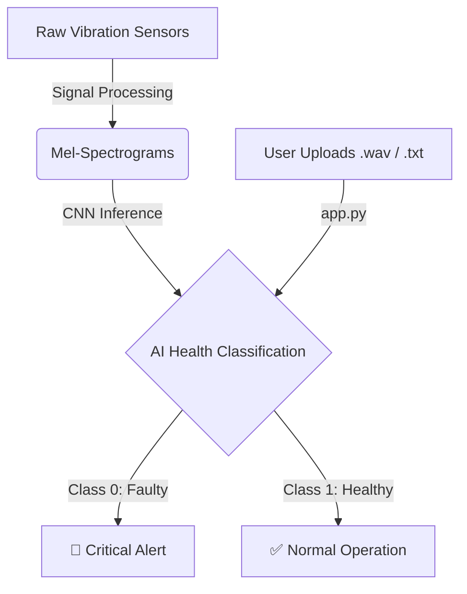

<div align="center">
  <h1>🔊 Echo-Guard</h1>
  <h3>Industrial IoT Predictive Maintenance System</h3>
  <p>End-to-end Deep Learning application to detect machinery failure from raw sensor data before it happens.</p>
  
  <p>
    
    
    
    
    
  </p>
</div>

---

##  Table of Contents
- [About the Project](#about-the-project)
- [Architecture & Workflow](#architecture--workflow)
- [Project Structure](#project-structure)
- [Quickstart Guide](#quickstart-guide)
- [Docker Deployment](#docker-deployment)
- [Model Details](#model-details)

---

##  About the Project

**Echo-Guard** processes raw vibration sensor data (e.g., NASA Bearing Dataset), converts the time-domain signals into Frequency-Domain Mel-Spectrograms, and uses a custom Convolutional Neural Network (CNN) to classify equipment health in real-time. 

### Key Features
* **Advanced Signal Processing:** Automated pipeline converting time-domain vibration data into spectrograms using `Librosa`.
* **Deep Learning Engine:** 2D-CNN architecture built with `TensorFlow/Keras` achieving >95% validation accuracy.
* **Real-Time Dashboard:** Interactive User Interface built with `Streamlit` for live sensor monitoring and Go/No-Go alerts.
* **Containerized Deployment:** Ready to be shipped to any cloud environment using Docker.

---

##  Architecture & Workflow



---

## 📂 Project Structure

```text
EchoGuard/
├── data/
│   ├── raw/                   # NASA raw vibration datasets (.txt/.csv)
│   └── processed/             # Generated Mel-spectrogram images (.png)
├── frontend/
│   └── app.py                 # Streamlit dashboard interface
├── models/
│   ├── model.py               # Model architecture definitions
│   └── echo_guard_model.keras # Pre-trained network weights
├── src/
│   ├── preprocessing.py       # STFT & Spectrogram generation pipeline
│   ├── train_model.py         # Keras CNN training loop & evaluation
│   └── __init__.py
├── requirements.txt           # Python dependencies
├── Dockerfile                 # Container deployment configuration
└── README.md                  # Project documentation
```

---

##  Quickstart Guide

### 1. Local Setup
Ensure you have Python 3.9+ installed.

```bash
# Clone the repository
git clone https://github.com/sadvik-asus/Echo-Guard-Predictive-Maintenance.git
cd Echo-Guard-Predictive-Maintenance

# Create and activate a virtual environment
python -m venv venv
source venv/bin/activate  # On Windows use: .\venv\Scripts\activate

# Install dependencies
pip install -r requirements.txt
```

### 2. Run the Dashboard
```bash
cd frontend
streamlit run app.py
```
Open your browser and navigate to `http://localhost:8501`.

---

## 🐳 Docker Deployment

The easiest way to deploy Echo-Guard into production is via Docker.

**1. Build the Docker Image:**
```bash
docker build -t echo-guard-app:latest .
```

**2. Run the Container:**
```bash
docker run -p 8501:8501 echo-guard-app:latest
```
Access the dashboard :  `http://localhost:8501`.

---

##  Model Details
The AI engine uses a custom Sequential CNN architecture designed specifically for image-based spectrogram classification:
* **Input Shape:** 256x256x3 (RGB Spectrograms)
* **Feature Extraction:** 3 Convolutional Blocks (16 -> 32 -> 64 filters) with MaxPooling.
* **Classification Head:** Dense layer (128 units) with 50% Dropout to prevent overfitting, followed by a Sigmoid output.
* **Optimizer:** Adam
* **Loss Function:** Binary Crossentropy

---
<div align="center">
  <i>Developed for Industrial IoT predictive maintenance scenarios.</i>
</div>
