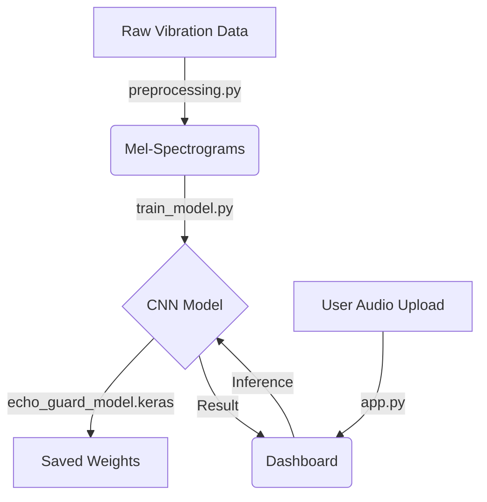

# Echo-Guard: Industrial Predictive Maintenance System 🔊

**Echo-Guard** is an end-to-end Deep Learning application designed to predict machinery failure before it happens. It processes raw vibration sensor data from the NASA Bearing Dataset, converts signals into Mel-Spectrograms, and uses a Convolutional Neural Network (CNN) to classify equipment health in real-time.


---

## 🏗️ Architecture




## 📂 Project Structure

```text
EchoGuard/
├── data/
│   ├── raw/                # NASA raw vibration datasets
│   └── processed/          # Generated Mel-spectrogram images
├── frontend/
│   └── app.py              # Streamlit dashboard
├── models/
│   ├── model.py            # Model architecture definitions
│   └── echo_guard_model.keras # Saved weights (downloaded on first run)
├── src/
│   ├── preprocessing.py    # STFT & Spectrogram generation
│   ├── train_model.py      # Keras CNN training loop
│   └── __init__.py
├── requirements.txt        # Python dependencies
└── README.md               # This file
```

## 🚀 Key Features
* **Signal Processing:** Automated pipeline to convert Time-Domain vibration data to Frequency-Domain Spectrograms using `Librosa`.
* **Deep Learning:** Custom 2D-CNN architecture built in `TensorFlow/Keras` achieving >95% accuracy.
* **Real-Time Dashboard:** Interactive User Interface built with `Streamlit` for live sensor monitoring.
* **Fault Detection:** Distinguishes between "Healthy" operation and "Critical" bearing degradation.

## 🛠 Tech Stack
* **Python 3.9**
* **TensorFlow/Keras** (CNN Implementation)
* **Librosa** (Audio Feature Extraction)
* **Streamlit** (Frontend)
* **Pandas/NumPy** (Data Engineering)

## 📸 How It Works
1.  **Input:** System accepts raw NASA sensor data (or .wav files).
2.  **Preprocessing:** Applies Short-Time Fourier Transform (STFT) to generate a spectrogram.
3.  **Inference:** The CNN analyzes the visual pattern of the spectrogram.
4.  **Output:** Returns a confidence score and a Go/No-Go maintenance alert.

## 💻 Quickstart Guide

### 1. Clone the repository
```bash
git clone https://github.com/sadvik-asus/Echo-Guard-Predictive-Maintenance.git
cd Echo-Guard-Predictive-Maintenance
```

### 2. Create and activate a virtual environment
```bash
python -m venv venv
# On Windows:
.\venv\Scripts\activate
# On Mac/Linux:
source venv/bin/activate
```

### 3. Install dependencies
```bash
pip install -r requirements.txt
```

### 4. Run the Dashboard
```bash
cd frontend
streamlit run app.py
```
